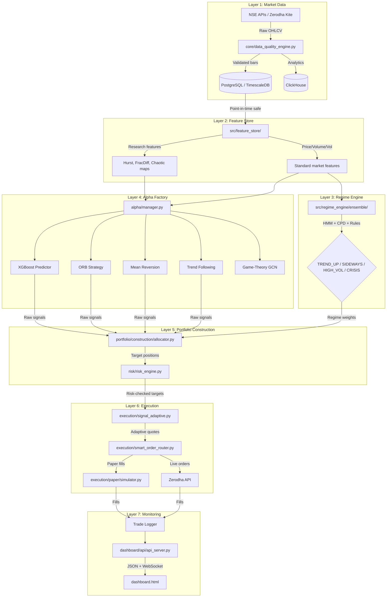

# Institutional Quant Research OS

An end-to-end quantitative research and algorithmic trading platform for Indian markets (NSE/BSE).

**Current state:** Research prototype with validated backtesting framework, multiple alpha signal families, and a regime-aware architecture. Not yet live trading. The system has been through a rigorous architectural audit and is undergoing a transformation from research accumulation to production discipline.

---

## Table of Contents

1. [System Architecture](#system-architecture)
2. [Target Architecture (9 Layers)](#target-architecture-9-layers)
3. [File Architecture](#file-architecture)
4. [What Each Component Does](#what-each-component-does)
5. [How to Run Everything](#how-to-run-everything)
6. [Database Setup](#database-setup)
7. [Running the Backend API](#running-the-backend-api)
8. [Running Backtests & Research](#running-backtests--research)
9. [Running AI/ML Pipelines](#running-aiml-pipelines)
10. [Running All Tests](#running-all-tests)
11. [Known Gaps & Honest Assessment](#known-gaps--honest-assessment)
12. [12-Month Roadmap](#12-month-roadmap)

---

## System Architecture

The system flows data through these stages:

```
NSE/Brokers → Data Validation → Feature Store → Alpha Signals → Regime Weighting → Portfolio Construction → Risk Checks → Execution → Trade Logging
```



---

## Target Architecture (9 Layers)

This is the destination architecture. The current system partially implements each layer.

| Layer | Component | Responsibility | Current State |
|-------|-----------|---------------|---------------|
| 1. Market Data | `data/`, `core/data_quality_engine.py` | Acquire, validate, store raw data | ✅ Basic — needs corporate action pipeline |
| 2. Feature Store | `src/feature_store/`, `features/` | Compute & cache all features with point-in-time safety | ⚠️ Exists — needs single unified store |
| 3. Regime Engine | `src/regime_engine/` | Classify market regime (HMM + CPD ensemble) | ✅ Working |
| 4. Alpha Factory | `alpha/`, `src/alpha_factory/` | Registry of validated signals, IC-gated promotion | ⚠️ Exists — needs IC tracking & gating |
| 5. Portfolio | `portfolio/construction/` | Convert signals to target weights with constraints | ⚠️ Exists — needs single optimizer |
| 6. Risk Engine | `risk/` | VaR limits, SEBI compliance, circuit breakers | ✅ Working |
| 7. Execution | `execution/`, `src/execution/` | Signal-adaptive quoting, smart order routing | ✅ Working (paper mode) |
| 8. Monitoring | `dashboard/api/`, `src/monitoring/` | Real-time health, prediction tracking, decay detection | ⚠️ Partial — needs prediction registry |
| 9. Analytics | `analytics/` | Backtesting, walk-forward validation, attribution | ✅ Strong |

---

## File Architecture

```text
institutional-quant-research-os/
├── main.py                          # Production orchestrator (backtest/live modes)
├── app.py                           # CLI for research commands and demos
├── dashboard.html                   # Single-page trading dashboard
├── requirements.txt                 # Full dependency list
├── requirements-minimal.txt         # Lightweight local setup
│
├── src/                             # ── CANONICAL MODERN MODULES ──────────────
│   ├── alpha_factory/               # Alpha registry, evolution, ranking
│   │   ├── evolution.py             #   LLM/genetic alpha mutation (MadEvolve)
│   │   ├── ranker/                  #   Alpha candidate ranking
│   │   ├── registry/                #   Active/candidate alpha registry
│   │   └── alphas/                  #   Signal implementations
│   │       ├── game_theory_graph.py #     BCF-GCN graph neural network
│   │       ├── unified_alpha.py     #     Combined multi-alpha signal
│   │       ├── momentum_alphas.py   #     Momentum factor signals
│   │       ├── mean_reversion_alphas.py
│   │       ├── factor_alphas.py
│   │       ├── volatility_alphas.py
│   │       └── options_alphas.py
│   ├── regime_engine/               # Market regime detection
│   │   ├── ensemble/ensemble.py     #   Ensemble of HMM + CPD detectors
│   │   ├── hmm/hmm_detector.py      #   Hidden Markov Model detector
│   │   └── cpd/cpd_detector.py      #   Change-point detection
│   ├── feature_store/               # Deterministic feature computation
│   │   ├── compute/                 #   Feature computers
│   │   │   ├── research_features.py #     Hurst, FracDiff, Chaotic maps
│   │   │   ├── price_features.py
│   │   │   ├── volume_features.py
│   │   │   └── volatility_features.py
│   │   ├── definitions/base.py      #   Feature catalog definitions
│   │   └── versioning/              #   Feature version tracking
│   ├── execution/                   # Order execution adapters
│   │   ├── signal_adaptive.py       #   Yu-inspired quote depth engine
│   │   ├── brokers/zerodha_adapter.py
│   │   ├── smart_order_router/
│   │   └── fill_simulator/
│   ├── backtest/                    # Modern backtesting engines
│   │   ├── vectorized/             #   Fast vectorized backtester
│   │   ├── event_driven/           #   Tick-level event-driven backtester
│   │   └── walk_forward/           #   Walk-forward validation
│   ├── portfolio/                   # Portfolio optimization
│   │   ├── engine.py               #   Portfolio construction engine
│   │   ├── optimizer/              #   HRP, Kelly criterion
│   │   ├── risk_budget/            #   Risk budgeting
│   │   └── signal_combiner/        #   Signal aggregation
│   ├── risk/                        # Advanced risk metrics
│   │   └── advanced_metrics.py      #   Weibull VaR, FIGARCH, deflated Sharpe
│   ├── ml/                          # Machine learning models
│   │   ├── trainer.py              #   Walk-forward training with purge/embargo
│   │   ├── ensemble.py             #   Model ensembling
│   │   └── inference.py            #   Production inference
│   ├── monitoring/                  # Operational monitoring
│   │   ├── drift_detector.py       #   Feature/model drift detection
│   │   ├── alert_manager.py        #   Alert routing
│   │   └── metrics.py              #   Prometheus metrics
│   ├── data_gateway/               # Data ingestion
│   │   └── nse/nse_gateway.py      #   NSE data gateway
│   └── shared/                      # Shared utilities
│       ├── db/                     #   Database connections (Postgres, Redis)
│       └── dsa/                    #   Data structures (ring buffer, segment tree)
│
├── alpha/                           # ── LEGACY ALPHA STRATEGIES ───────────────
│   ├── manager.py                   # Core alpha orchestrator
│   ├── xgboost_predictor.py         # XGBoost model inference
│   ├── orb_strategy.py              # Opening Range Breakout
│   ├── orb_zarattini.py             # ORB with Zarattini enhancements
│   ├── vwap_trend_zarattini.py      # VWAP trend following
│   ├── put_call_carry_shin.py       # Put-call carry strategy
│   ├── mean_reversion_strategies.py # Mean reversion family
│   ├── momentum_strategies.py       # Momentum family
│   ├── trend_following_strategies.py # Trend following family
│   ├── tsmom_strategies.py          # Time-series momentum
│   ├── volatility_strategies.py     # Volatility strategies
│   ├── statistical_arbitrage.py     # Stat arb strategies
│   ├── microstructure_strategies.py # Market microstructure
│   ├── options_strategies.py        # Options strategies
│   ├── factor_strategies.py         # Factor investing
│   ├── madevolve.py                 # Genetic alpha evolution
│   ├── prediction_storage.py        # Prediction persistence (SQLite)
│   └── strategy_orchestrator.py     # Strategy coordination
│
├── analytics/                       # ── BACKTESTING & VALIDATION ──────────────
│   ├── backtesting/
│   │   ├── backtester.py            # Main backtesting engine
│   │   ├── purged_walk_forward.py   # ★ Purged walk-forward CV (KEEP)
│   │   ├── event_driven_backtester.py
│   │   ├── institutional_backtester.py
│   │   ├── commission.py            # Commission models
│   │   ├── slippage.py              # Slippage models
│   │   ├── market_impact.py         # Market impact models
│   │   └── performance_analytics.py # Performance attribution
│   └── validation/
│       ├── multiple_testing_correction.py  # ★ Deflated Sharpe, Bonferroni (KEEP)
│       ├── red_team_validation.py          # ★ Adversarial testing (KEEP)
│       ├── adversarial_validator.py
│       ├── point_in_time_validator.py
│       └── signal_validator.py
│
├── execution/                       # ── EXECUTION ENGINE ──────────────────────
│   ├── signal_adaptive.py           # ★ Signal-adaptive quoting (KEEP)
│   ├── smart_order_router.py        # Multi-broker order routing
│   ├── unified_execution_engine.py  # Unified execution path
│   ├── paper_trading.py             # Paper trading simulator
│   ├── adapters/                    # Backtest/paper/live adapters
│   ├── routing/                     # Execution algorithms (TWAP, VWAP, etc.)
│   └── paper/simulator.py           # Realistic fill simulation
│
├── risk/                            # ── RISK MANAGEMENT ───────────────────────
│   ├── risk_engine.py               # Core risk aggregator
│   ├── institutional_risk_engine.py # Full institutional risk
│   ├── sebi_algo_compliance.py      # ★ SEBI algo trading rules (KEEP)
│   ├── circuit_breaker.py           # Trading halt logic
│   ├── var_cvar_limits.py           # VaR/CVaR position limits
│   ├── evt_tail_risk.py             # Extreme value theory
│   ├── stress_testing.py            # Scenario stress tests
│   └── volatility_targeting.py      # Vol-targeting position sizing
│
├── foundation/                      # ── THEORETICAL FOUNDATION (KEEP ALL) ────
│   ├── math_toolkit.py              # Probability, stochastic processes, Monte Carlo
│   ├── market_efficiency.py         # Hurst test, variance ratio, runs test
│   ├── portfolio_optimization.py    # MV, HRP, Black-Litterman
│   ├── option_pricing.py            # Black-Scholes, Greeks
│   ├── factor_models.py             # Fama-French, APT
│   ├── honest_evaluation.py         # Deflated Sharpe, prediction intervals
│   ├── no_arbitrage.py              # No-arbitrage detectors
│   ├── limits_to_arbitrage.py       # Arbitrage friction models
│   └── agency_theory.py             # Agency theory monitors
│
├── features/                        # ── FEATURE ENGINEERING ───────────────────
│   ├── fractional_differencing.py   # ★ FracDiff for stationarity (KEEP)
│   ├── chaotic_features.py          # Logistic/tent map features
│   ├── advanced_feature_engineering.py
│   └── feature_store.py             # Legacy feature store
│
├── data/                            # ── DATA LAYER ────────────────────────────
│   ├── nse_market_calendar.py       # ★ NSE holidays & market hours (KEEP)
│   ├── nifty50_symbols.py           # NIFTY 50 universe loader
│   ├── nifty500_symbols.py          # NIFTY 500 universe loader
│   ├── corporate_actions.py         # Corporate action handling
│   ├── data_loader.py               # Data loading utilities
│   └── predictions.db               # SQLite prediction store
│
├── core/                            # ── CORE INFRASTRUCTURE ───────────────────
│   ├── data_quality_engine.py       # Data validation engine
│   ├── market_hours.py              # Market status detection
│   ├── regime_engine.py             # Legacy regime engine
│   ├── event_engine.py              # Event-driven architecture
│   ├── logging_config.py            # Structured logging
│   └── config/                      # Platform configuration
│       ├── config.yaml
│       ├── platform_config.yaml
│       └── settings.py
│
├── dashboard/                       # ── DASHBOARD ─────────────────────────────
│   └── api/api_server.py            # FastAPI backend (serves dashboard.html)
│
├── configs/                         # ── DATABASE SCHEMAS ──────────────────────
│   ├── schema_postgres.sql          # PostgreSQL schema
│   ├── schema_timescale.sql         # TimescaleDB hypertables
│   └── schema_clickhouse.sql        # ClickHouse analytics schema
│
├── research/                        # ── RESEARCH (experimental, not production)
│   ├── experiments/                 # Experimental pipelines
│   │   ├── alpha/                   # Alpha research (50+ experimental signals)
│   │   ├── ml/                      # ML experiments (ensemble, FinBERT, etc.)
│   │   ├── regime/                  # Regime research
│   │   └── factors/                 # Factor model research
│   └── validation/                  # Research validation tools
│
└── tests/                           # ── TEST SUITE ────────────────────────────
    ├── test_nextgen_quant_system.py  # Alpha factory, evolution, risk tests
    ├── test_research_features.py     # Feature computation tests
    ├── test_theoretical_foundation.py # Math toolkit, market efficiency tests
    ├── test_phase1_bias_controls.py  # Bias control tests
    ├── test_systematic_fixes.py      # System integration tests
    ├── test_risk_engine_fixes.py     # Risk engine tests
    ├── test_portfolio_allocator.py   # Portfolio construction tests
    ├── test_prediction_registry.py   # Prediction storage tests
    └── test_remaining_roadmap_components.py  # Roadmap component tests
```

---

## What Each Component Does

### Core Signal Flow

| Stage | Module | What It Does |
|-------|--------|-------------|
| Data Ingestion | `data/nifty50_symbols.py` | Loads current NIFTY 50/500 universe from NSE |
| Data Validation | `core/data_quality_engine.py` | Validates OHLCV integrity, staleness, price continuity |
| Feature Computation | `src/feature_store/compute/` | Computes 40–60 features (price, volume, volatility, research) |
| Research Features | `features/fractional_differencing.py` | Fractional differencing for stationarity preservation |
| Regime Detection | `src/regime_engine/ensemble/ensemble.py` | Ensembles HMM + CPD to classify market regime |
| Alpha Generation | `alpha/manager.py` | Runs active alpha signals on current features |
| ML Inference | `alpha/xgboost_predictor.py` | XGBoost model prediction on feature vectors |
| Portfolio Targets | `portfolio/construction/allocator.py` | Converts signals to target weights (HRP/equal weight) |
| Risk Filtering | `risk/risk_engine.py` | Enforces VaR, position limits, SEBI compliance |
| Execution | `execution/signal_adaptive.py` | Computes adaptive quote depths based on signal urgency |
| Order Routing | `execution/smart_order_router.py` | Routes orders to Zerodha or paper simulator |
| Trade Logging | `dashboard/api/api_server.py` | Records fills, computes PnL, serves dashboard |

### Strategy Families

| Strategy | File | Type | Status |
|----------|------|------|--------|
| Opening Range Breakout | `alpha/orb_zarattini.py` | Intraday momentum | Active, needs IC validation |
| VWAP Trend | `alpha/vwap_trend_zarattini.py` | Intraday trend | Active, needs IC validation |
| Put-Call Carry | `alpha/put_call_carry_shin.py` | Options carry | Active, needs IC validation |
| Time-Series Momentum | `alpha/tsmom_strategies.py` | Multi-day momentum | Active, needs IC validation |
| Mean Reversion | `alpha/mean_reversion_strategies.py` | Statistical reversion | Active, needs IC validation |
| Volatility Strategies | `alpha/volatility_strategies.py` | Vol carry/surface | Active, needs IC validation |
| Game-Theory GCN | `src/alpha_factory/alphas/game_theory_graph.py` | Graph neural net | Research only |
| LLM Alpha Evolution | `src/alpha_factory/evolution.py` | Genetic mutation | Research only |

---

## How to Run Everything

### Prerequisites

| Dependency | Version | Purpose |
|------------|---------|---------|
| Python | 3.10 or 3.11 | Runtime |
| PostgreSQL | 15+ | Relational storage, prediction registry |
| TimescaleDB | 2.x (PG extension) | Time-series OHLCV storage |
| ClickHouse | Latest | Analytics DB (optional — falls back to SQLite) |
| Redis | 7+ | Cache, real-time state sharing |
| TA-Lib | Latest | Technical analysis C library |

#### macOS Setup (Homebrew)

```bash
brew install postgresql@15 redis ta-lib
# Optional:
brew install clickhouse
```

#### Install Python Dependencies

```bash
python3 -m venv .venv
source .venv/bin/activate
pip install -r requirements.txt
```

For a lighter setup without ML models:
```bash
pip install -r requirements-minimal.txt
```

---

## Database Setup

### Start Services
```bash
brew services start postgresql@15
brew services start redis
# Optional:
brew services start clickhouse
```

### Initialize Schemas
```bash
createdb quant_research
psql -d quant_research -f configs/schema_postgres.sql
psql -d quant_research -f configs/schema_timescale.sql
# Optional:
clickhouse-client --queries-file configs/schema_clickhouse.sql
```

### Configure Environment
Create `.env` in the project root:
```env
REDIS_URL=redis://localhost:6379/0
POSTGRES_URL=postgresql://localhost/quant_research
CLICKHOUSE_HOST=localhost
CLICKHOUSE_PORT=8123
JWT_SECRET_KEY=your_secret_key_here
```

---

## Running the Backend API

The FastAPI server serves the dashboard and all API endpoints:

```bash
python3 -m uvicorn dashboard.api.api_server:app --host 127.0.0.1 --port 8001 --reload
```

- **Dashboard**: http://127.0.0.1:8001/
- **API Docs**: http://127.0.0.1:8001/docs
- **System Health**: http://127.0.0.1:8001/api/system-health

---

## Running Backtests & Research

### Full Backtest
```bash
python3 main.py --config config/config.yaml --mode backtest
```

### Research Demos
```bash
python3 app.py state-demo       # Market state analysis
python3 app.py event-demo       # Event-driven demo
python3 app.py data-audit-demo  # Data quality audit
```

---

## Running AI/ML Pipelines

### XGBoost Training (Walk-Forward)
The trainer uses purged walk-forward CV with embargo gaps:
```bash
python3 -c "from src.ml.trainer import WalkForwardTrainer; WalkForwardTrainer().run()"
```

### Alpha Evolution (MadEvolve)
Genetic alpha mutation with optional LLM integration:
```bash
python3 -c "from src.alpha_factory.evolution import MadEvolveAlphaEngine; MadEvolveAlphaEngine().evolve(iterations=5)"
```

### Game-Theory GCN (Research)
```bash
python3 -c "from src.alpha_factory.alphas.game_theory_graph import BCFGraphNet; print('GCN loaded')"
```

---

## Running All Tests

### Full Suite (81 tests)
```bash
python3 -m pytest -q -o addopts='' tests
```

### Individual Test Modules
```bash
# Alpha factory, evolution, advanced risk
python3 -m pytest tests/test_nextgen_quant_system.py -v

# Research features (Hurst, FracDiff, chaotic maps)
python3 -m pytest tests/test_research_features.py -v

# Theoretical foundation (math toolkit, market efficiency)
python3 -m pytest tests/test_theoretical_foundation.py -v

# Risk engine and institutional risk
python3 -m pytest tests/test_risk_engine_fixes.py -v

# Portfolio allocator
python3 -m pytest tests/test_portfolio_allocator.py -v

# Prediction storage
python3 -m pytest tests/test_prediction_registry.py -v

# Bias controls (point-in-time, ORB, VWAP, PCP)
python3 -m pytest tests/test_phase1_bias_controls.py -v

# System integration
python3 -m pytest tests/test_systematic_fixes.py -v
```

---

## Known Gaps & Honest Assessment

These are the real problems identified by architectural audit, in priority order:

| Gap | Impact | Difficulty | Status |
|-----|--------|------------|--------|
| No prediction outcome tracking | Cannot detect alpha decay | Medium (2 weeks) | ❌ Not started |
| No point-in-time universe membership | Backtest Sharpe contains survivorship bias | Medium-hard | ❌ Not started |
| No corporate actions pipeline | Historical prices show false jumps as signals | Hard (3–4 weeks) | ❌ Not started |
| Multiple parallel implementations | Cannot trust which code runs | Medium (consolidation) | 🔄 Phase 1 done |
| No IC measurement for signals | Cannot know which signals work | Medium (2 weeks) | ❌ Not started |
| No transaction cost model for India | Strategies profitable pre-cost may be losers | Low-medium | ⚠️ Partial |
| No data freshness SLA enforcement | Model runs on stale prices silently | Low (1 week) | ⚠️ Partial |

---

## 12-Month Roadmap

| Month | Focus | Key Deliverables |
|-------|-------|-----------------|
| 1 | Foundation | Unified NSE data loader, data quality gate, corporate actions table, remove duplicates |
| 2 | Alpha Validation | Prediction registry, IC computation for all signals, discard IC < 0.02 |
| 3 | Architecture | Single canonical `src/` for each component, MLflow experiment tracking |
| 4–5 | Data & Features | FII/DII flows, delivery %, India VIX term structure, point-in-time enforcement |
| 6 | New Alpha | Regime-conditional signal weighting, alpha decay detection |
| 7–8 | Paper Trading | Live Zerodha WebSocket feed, paper trading with real prices, prediction tracking |
| 9–10 | Live Trading | Small capital (₹5–10L), real execution, daily performance reports |
| 11–12 | Scale | Expand universe (NIFTY 200), capacity analysis, execution quality improvement |

**Target:** Sharpe > 1.0 net of costs on validated signals with regime conditioning within 12 months.

---

## Development Time Allocation (Recommended)

| Area | Recommended | Current (estimated) |
|------|------------|-------------------|
| Data engineering | 30% | 15% |
| Alpha research & validation | 35% | 20% |
| Portfolio construction & risk | 15% | 10% |
| Execution | 10% | 10% |
| Monitoring & infrastructure | 10% | 45% ← inverted |
